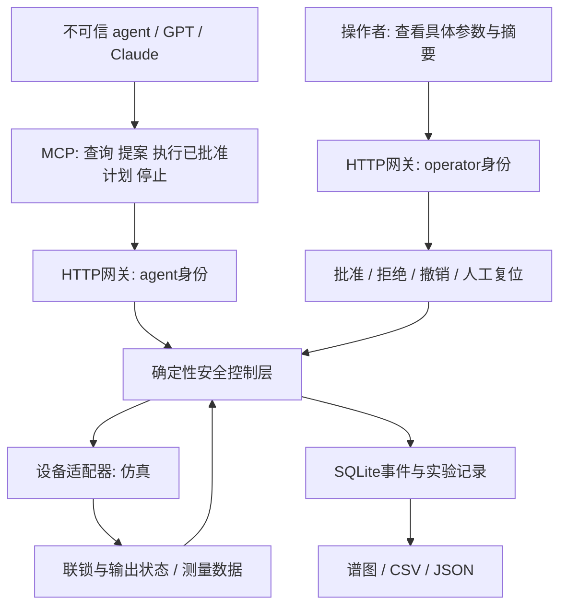

# AI4S human-in-the-loop 安全设计

目标：agent承担上位机中的实验提案、数据查询和已批准流程执行；人工保留批准、拒绝、撤销与复位的权力。规则在可信执行层强制生效，不能仅依赖系统提示词。

## 执行边界

MCP连接与HTTP身份检查不会自行解决实体安全。真实部署还需在此图之下加入独立硬件联锁、安全控制器与实体急停；这些应在agent、网关或操作系统失效时仍能工作。

## 人工审批生命周期

1. agent提交计划，控制层校验有限数值、角度/步长/驻留范围、点数与曝光预算。
2. 计划进入PENDING，操作者查看参数、执行模式、计划ID、摘要与截止时间。提案本身不启动设备。
3. 操作者提交APPROVE、REJECT或REVOKE及备注。提交的expected_hash必须匹配展示的计划摘要。
4. agent请求执行时只传plan_id。控制层使用已批准参数，拒绝过期、重复、被拒绝或撤销的计划。
5. 启动前重新检查设备反馈、当前状态、审批所属安全epoch和设备模式。检查期间有停止请求则epoch改变，启动被拒绝。
6. 批准最多60秒，单次使用；停止、急停、复位和进程重启清除旧批准。每个后续实验重新提案和审批，不以一次人工批准授权无限循环。

批准不等于启动，不豁免设备联锁。拒绝与撤销不能由agent解除，须重新提案。运行中的中断通过停止或软件急停处理；不会尝试撤销已发生的物理操作。

## 权限

|操作|agent|操作者|
|---|---|---|
|查询状态/数据、提交提案|允许|允许|
|启动|仅自身已获人工批准的计划|已批准的计划|
|批准、拒绝、撤销|拒绝|允许，绑定摘要|
|正常停止、软件急停|允许，无需审批|允许，无需审批|
|复位|拒绝|健康联锁、无活动任务、安全输出确认后允许|
|故障注入/导入数据|拒绝|仅当前模拟demo|

HTTP角色来自不同bearer凭据，不能通过请求体覆盖。MCP仅持有agent凭据。核心里的operator字符串用于可信应用内部调用，不能暴露为模型可选参数。

本地demo将两份凭据存在同一用户目录，不能抵御同账号恶意程序读取文件；它验证的是接口权限逻辑。生产环境要把agent放在独立账号/容器中，不挂载operator凭据、控制层源码、设备驱动端口或设备网段。MCP服务不应持有operator密钥。人工身份应来自SSO或独立工作站，审计应记录真实身份。当前operator只是单操作者角色名。

## 状态与故障行为

|状态|启动|人工复位|恢复行为|
|---|---|---|---|
|RECOVERY|拒绝|满足安全检查后允许|进程启动不自动恢复实验|
|IDLE|已批准计划可启动|允许但使审批失效|不启用设备输出|
|RUNNING/STOPPING|拒绝新计划执行|拒绝|停止请求先取消任务，再确认安全输出|
|COMPLETED/STOPPED|拒绝|安全检查后允许|复位后仍需新审批|
|ESTOP|拒绝|确认健康联锁、安全输出且无活动任务后允许|联锁恢复不自动复位|

软件急停锁存状态写入SQLite；重启保留ESTOP，其他状态进入RECOVERY。正常运行的数据周期保存，每20点一次；进程突然终止可能丢失最近的点。历史数据不会作为新实验自动恢复。

停止请求先派发设备关闭输出，再写审计，以免存储延迟挡住关闭请求。停止反馈异常会锁存ESTOP；I/O超时会隔离设备调用，禁止直接复位，须退出服务、排查并重启。调用超时只表示软件停止等待，不保证底层函数已停止。生产驱动必须实现协议超时、取消/命令栅栏和独立的停机通道。

SQLite写入失败会阻止后续启动并请求安全停止。数据库不是防篡改审计，损坏时不能保证持久锁存；下一次进程至少要求RECOVERY检查。生产急停锁存必须由独立控制器持久维护。

## 数据与agent安全

数据必须是有限数值、合法角度、非负强度，导入角度严格递增。导入CSV/JSON仅产生数据记录，不执行代码或设备命令。导入数据标记IMPORTED_UNVERIFIED，不能通过导入文件覆盖审批、角色或设备状态。

agent看到的数据与文本均可能含提示注入。即使模型接受了“忽略安全规则”，也无法通过允许的工具自批或复位。此结论依赖隔离成立：如果给agent任意shell、operator密钥或直接设备访问，则可绕开网关，当前安全边界不再成立。

## 生产上线前仍需证明的事项

- 根据真实XRD型号与实验流程做危险分析，定义异常时的安全输出；冷却或排风等保护不能被一刀切断电破坏。
- 明确设备门联锁、辐射监测、机械运动保护、实体急停及手动复位。以厂商安全接口和经过验证的硬件为依据。
- 为各安全功能确定所需可靠性与停止时限；本代码不声称具备安全PLC、SIL/PL等级或确定性实时响应。
- 做断网、进程崩溃、电脑断电、失去冷却、门打开、传感器卡住、反馈延迟、重复命令和设备拒绝停机的现场故障试验。
- 补充独占设备租约、驱动级命令幂等与取消、独立看门狗、统一身份认证、密钥隔离、权限变更管理和受保护审计。
- 人工审批应有培训、职责和信息展示标准；高风险流程按风险评估决定是否需要双人审批。人点了批准不能替代物理安全证据。

本项目已实现并测试上述审批和模拟状态机；实体设备、硬件安全功能、MCP客户端联调与现场验收仍未完成。
